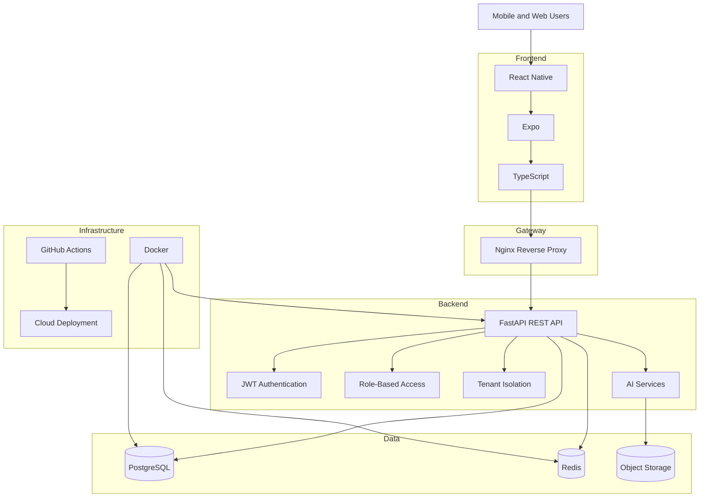
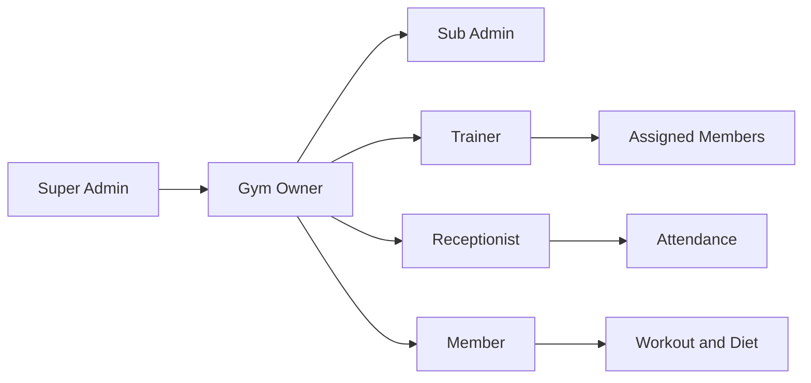
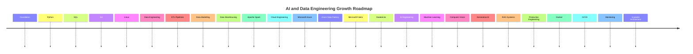

<!-- ========================= -->

<!--      PROFILE HEADER       -->

<!-- ========================= -->

<div align="center">


<br/>

<a href="https://github.com/gwc-sys">
  
</a>

<a href="https://www.linkedin.com/in/mahesh-r-0a109b20a/">
  
</a>

<a href="mailto:mahesh-raskar@outlook.com">
  
</a>

<a href="https://www.instagram.com/_mahesh.raskar/">
  
</a>

<br/><br/>


<br/><br/>

<a href="https://git.io/typing-svg">
  
</a>

</div>

---

<!-- ========================= -->

<!--        INTRODUCTION       -->

<!-- ========================= -->

<table>
<tr>
<td width="65%" valign="top">

## 👋 About Me

I am **Mahesh Raskar**, an aspiring **AI Engineer**, **Data Engineer**, and **Full-Stack Developer** from India.

I enjoy building intelligent applications, cloud-based data systems, scalable APIs, analytical dashboards, and mobile products that solve real-world problems.

My current work combines:

* Artificial Intelligence
* Generative AI
* Data Engineering
* Full-Stack Development
* Cloud Computing
* Backend Architecture
* Mobile Application Development
* Data Analytics

I am especially interested in building systems where **AI, data, cloud, APIs, and user experience work together as one complete product**.

</td>

<td width="35%" valign="top">

## ⚡ Developer Snapshot

```yaml
Name: Mahesh Raskar
Username: gwc-sys
Location: India

Focus:
  - AI Engineering
  - Data Engineering
  - Cloud Platforms
  - Full-Stack Systems

Main Stack:
  - Python
  - SQL
  - TypeScript
  - FastAPI
  - React Native
  - PostgreSQL

Current Goal:
  Build production-ready
  AI and data products
```

</td>
</tr>
</table>

---

<!-- ========================= -->

<!--       VALUE SECTION       -->

<!-- ========================= -->

<div align="center">

## 🚀 What I Do

</div>

<table>
<tr>
<td width="33%" align="center" valign="top">

### 🤖 AI Engineering

Building intelligent features using:

`Machine Learning`

`Computer Vision`

`Generative AI`

`RAG Systems`

`AI Assistants`

`Predictive Analytics`

</td>

<td width="33%" align="center" valign="top">

### 📊 Data Engineering

Designing reliable data systems using:

`ETL and ELT`

`Data Pipelines`

`Apache Spark`

`Data Warehousing`

`Data Lakes`

`Cloud Analytics`

</td>

<td width="33%" align="center" valign="top">

### 💻 Product Engineering

Developing scalable applications using:

`React Native`

`FastAPI`

`PostgreSQL`

`Redis`

`Docker`

`Cloud Deployment`

</td>
</tr>
</table>

---

<!-- ========================= -->

<!--       CURRENT STATUS      -->

<!-- ========================= -->

## 🎯 Current Mission

<table>
<tr>
<td width="50%" valign="top">

### Currently Building

* AI-powered fitness applications
* Multi-tenant enterprise SaaS systems
* Data processing and analytics pipelines
* Secure REST APIs with FastAPI
* React Native mobile applications
* Role-based management dashboards
* Computer vision workout analysis
* Cloud-ready backend architectures

</td>

<td width="50%" valign="top">

### Currently Learning

* Apache Spark and PySpark
* Microsoft Azure
* Azure Data Factory
* Microsoft Fabric
* Databricks
* AWS cloud services
* Data lakehouse architecture
* Generative AI and RAG
* Vector databases
* System design

</td>
</tr>
</table>

---

<!-- ========================= -->

<!--      TECHNOLOGY STACK     -->

<!-- ========================= -->

<div align="center">

## 🧠 Technology Universe

<p>
  
</p>

</div>

<details open>
<summary><h3>🤖 Artificial Intelligence and Machine Learning</h3></summary>

<br/>

<div align="center">


<br/><br/>


</div>

<br/>

| Area             | Technologies and Concepts                                     |
| ---------------- | ------------------------------------------------------------- |
| Machine Learning | Scikit-learn, supervised learning, classification, regression |
| Deep Learning    | TensorFlow, Keras, PyTorch, neural networks                   |
| Computer Vision  | OpenCV, image processing, pose estimation                     |
| Generative AI    | LLM applications, prompt engineering, AI assistants           |
| RAG Systems      | Embeddings, document retrieval, vector search                 |
| Data Science     | NumPy, Pandas, data cleaning, feature preparation             |
| Evaluation       | Accuracy, precision, recall, validation and testing           |

</details>

<details open>
<summary><h3>📊 Data Engineering and Analytics</h3></summary>

<br/>

<div align="center">


<br/><br/>


</div>

<br/>

| Capability      | Tools and Skills                                       |
| --------------- | ------------------------------------------------------ |
| Data Processing | Python, Pandas, NumPy, PySpark                         |
| SQL Development | Joins, CTEs, window functions, subqueries              |
| Data Pipelines  | ETL, ELT, ingestion, transformation and scheduling     |
| Big Data        | Apache Spark, distributed processing                   |
| Warehousing     | Star schema, fact tables, dimension tables             |
| Data Storage    | PostgreSQL, MySQL, MongoDB, Redis                      |
| Analytics       | Power BI, dashboards, reporting and KPIs               |
| Data Quality    | Validation, deduplication, null handling and profiling |
| Cloud Data      | Azure Data Factory, Fabric, Databricks                 |

</details>

<details>
<summary><h3>🌐 Full-Stack and Mobile Development</h3></summary>

<br/>

<div align="center">


</div>

<br/>

<table>
<tr>
<td width="33%" valign="top">

### Frontend

* React
* React Native
* Expo
* TypeScript
* JavaScript
* HTML5
* CSS3
* Tailwind CSS
* Responsive interfaces
* State management

</td>

<td width="33%" valign="top">

### Backend

* FastAPI
* Python
* Node.js
* Express.js
* REST APIs
* JWT authentication
* API validation
* Service architecture
* Error handling
* Background processing

</td>

<td width="33%" valign="top">

### Application Architecture

* Multi-tenant systems
* Role-based access control
* Modular architecture
* Repository pattern
* API service layer
* Database migrations
* Secure authentication
* Caching
* Rate limiting
* Logging

</td>
</tr>
</table>

</details>

<details>
<summary><h3>☁️ Cloud, DevOps and Infrastructure</h3></summary>

<br/>

<div align="center">


<br/><br/>


</div>

<br/>

| Platform        | Focus                                              |
| --------------- | -------------------------------------------------- |
| Microsoft Azure | Data services, storage, deployment and pipelines   |
| AWS             | Cloud fundamentals, compute, storage and databases |
| Google Cloud    | Data and application services                      |
| Docker          | Containerized development and deployment           |
| Nginx           | Reverse proxy and API routing                      |
| GitHub Actions  | CI/CD automation                                   |
| Linux           | Development environment and server operations      |
| Git             | Source control and collaboration                   |

</details>

---

<!-- ========================= -->

<!--      FEATURED PROJECT     -->

<!-- ========================= -->

<div align="center">

## 🌟 Flagship Project

<a href="https://github.com/gwc-sys/gwcfit">
  
</a>

</div>

# 🏋️ PulseFit Enterprise Gym SaaS

> An intelligent, multi-tenant fitness management ecosystem designed for gym owners, administrators, trainers, receptionists, members and platform developers.

<div align="center">


</div>

<br/>

<table>
<tr>
<td width="50%" valign="top">

## 🏢 Business Platform

* Multi-gym tenant management
* Platform super administrator
* Gym owner management
* Sub-admin management
* Trainer management
* Reception management
* Member management
* Membership plans
* Payments and receipts
* QR attendance
* Role-based dashboards
* Tenant-isolated records

</td>

<td width="50%" valign="top">

## 🤖 Intelligent Fitness

* AI workout plan generation
* Camera-based form analysis
* Exercise pose detection
* Automatic repetition counting
* Workout quality feedback
* Progressive overload suggestions
* Recovery monitoring
* Fatigue insights
* AI fitness assistant
* Personalized recommendations
* Wearable integration architecture

</td>
</tr>
</table>

## 🧱 System Architecture



## 🔐 Role Architecture



## 🧰 PulseFit Stack

<div align="center">


</div>

---

<!-- ========================= -->

<!--     DEVELOPMENT ROADMAP   -->

<!-- ========================= -->

## 🗺️ Engineering Roadmap



## 📌 Current Skill Progress

| Technology       | Focus Area                                 | Progress       |
| ---------------- | ------------------------------------------ | -------------- |
| Python           | Automation, APIs and data processing       | ████████░░ 80% |
| SQL              | Analysis, joins, CTEs and window functions | ███████░░░ 70% |
| FastAPI          | Secure and scalable backend APIs           | ████████░░ 80% |
| React Native     | Cross-platform mobile development          | ████████░░ 80% |
| PostgreSQL       | Database design and queries                | ███████░░░ 70% |
| Data Engineering | ETL, data modelling and warehousing        | ██████░░░░ 60% |
| Apache Spark     | Distributed processing                     | ████░░░░░░ 40% |
| Databricks       | Lakehouse workflows                        | ███░░░░░░░ 30% |
| Microsoft Azure  | Cloud and data services                    | ████░░░░░░ 40% |
| Generative AI    | RAG, prompts and AI assistants             | ██████░░░░ 60% |
| Computer Vision  | Pose detection and analysis                | █████░░░░░ 50% |

---

<!-- ========================= -->

<!--      ENGINEERING FLOW     -->

<!-- ========================= -->

## ⚙️ How I Build Products

```mermaid
flowchart LR
    A[Understand the Problem]
    B[Design the Architecture]
    C[Create the Data Model]
    D[Build APIs]
    E[Develop the Interface]
    F[Add AI Features]
    G[Test and Secure]
    H[Containerize]
    I[Deploy]
    J[Monitor and Improve]

    A --> B --> C --> D --> E --> F --> G --> H --> I --> J
```



---

<!-- ========================= -->

<!--       GITHUB STATS        -->

<!-- ========================= -->

<div align="center">

## 📊 GitHub Command Center


<br/>


</div>

<details>
<summary><h3>📈 Open Complete GitHub Analytics</h3></summary>

<br/>

<div align="center">


<br/>


</div>

</details>

---

<!-- ========================= -->

<!--        TROPHIES           -->

<!-- ========================= -->

<div align="center">

## 🏆 GitHub Achievements


</div>

---

<!-- ========================= -->

<!--     CONTRIBUTION SNAKE    -->

<!-- ========================= -->

<div align="center">

## 🐍 Contribution Activity

<picture>
  <source
    media="(prefers-color-scheme: dark)"
    srcset="https://raw.githubusercontent.com/gwc-sys/gwc-sys/output/github-contribution-grid-snake-dark.svg"
  />
  <source
    media="(prefers-color-scheme: light)"
    srcset="https://raw.githubusercontent.com/gwc-sys/gwc-sys/output/github-contribution-grid-snake.svg"
  />
  
</picture>

</div>

---

<!-- ========================= -->

<!--      ENGINEERING MINDSET  -->

<!-- ========================= -->

## 💡 Engineering Principles

<table>
<tr>
<td width="25%" align="center">

### Build

Create practical products instead of only studying theory.

</td>

<td width="25%" align="center">

### Measure

Use data, testing and feedback to validate decisions.

</td>

<td width="25%" align="center">

### Improve

Refactor, optimize and strengthen every system continuously.

</td>

<td width="25%" align="center">

### Share

Document solutions and contribute knowledge to the community.

</td>
</tr>
</table>

---

<!-- ========================= -->

<!--      COLLABORATION        -->

<!-- ========================= -->

## 🤝 Open to Collaboration

I am interested in working on:

<div align="center">


</div>

---

<!-- ========================= -->

<!--        CONTACT            -->

<!-- ========================= -->

<div align="center">

## 📬 Let's Build Something Valuable

I am always open to learning, collaborating, discussing technology, and building meaningful products.

<br/>

<a href="https://github.com/gwc-sys">
  
</a>

<a href="https://www.linkedin.com/in/mahesh-r-0a109b20a/">
  
</a>

<a href="mailto:mahesh-raskar@outlook.com">
  
</a>

<br/><br/>

> **Build with purpose. Engineer with data. Innovate with intelligence.**

<br/>


</div>
